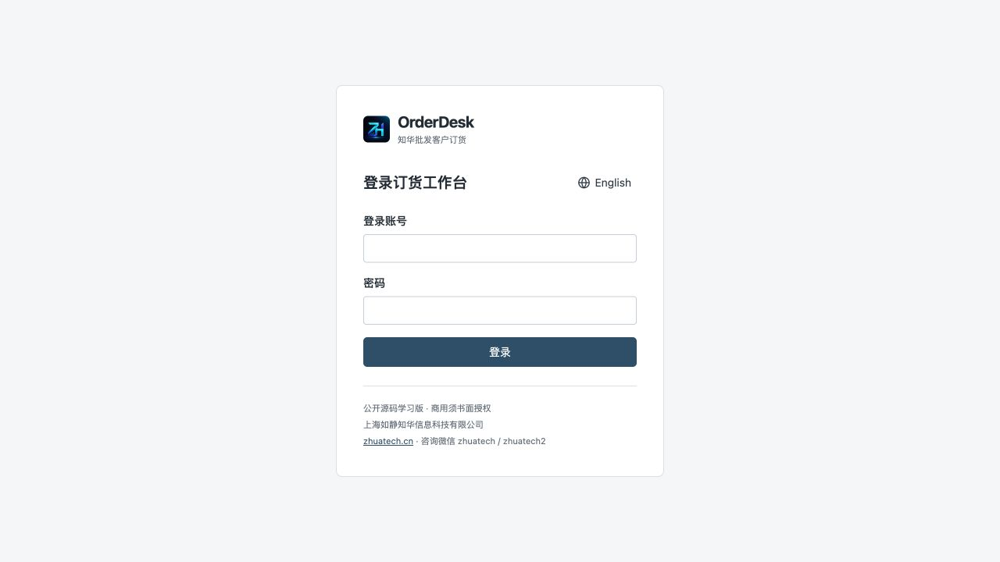
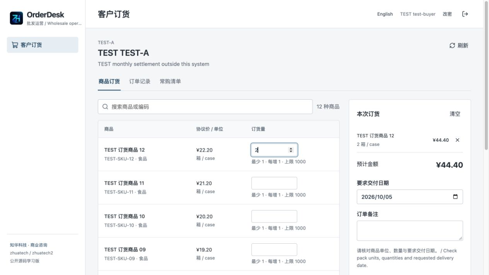
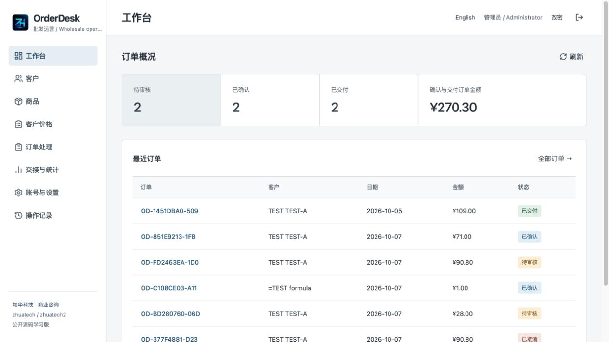
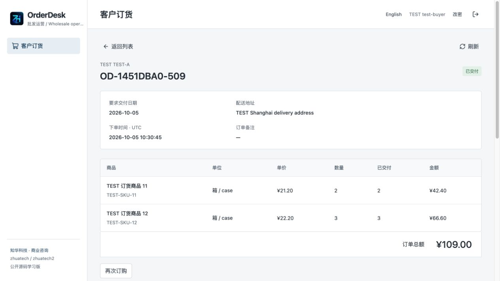
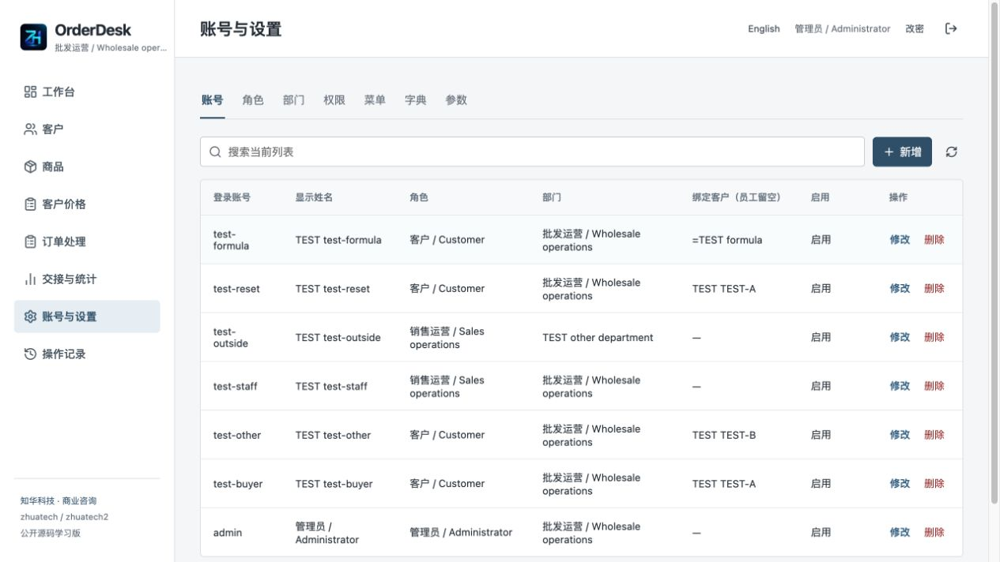
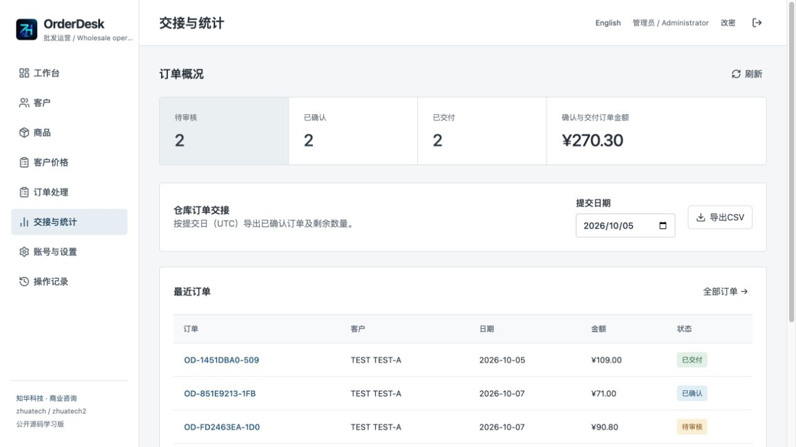
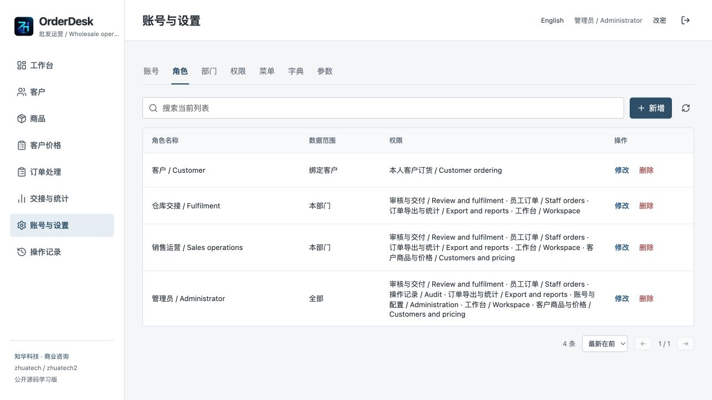
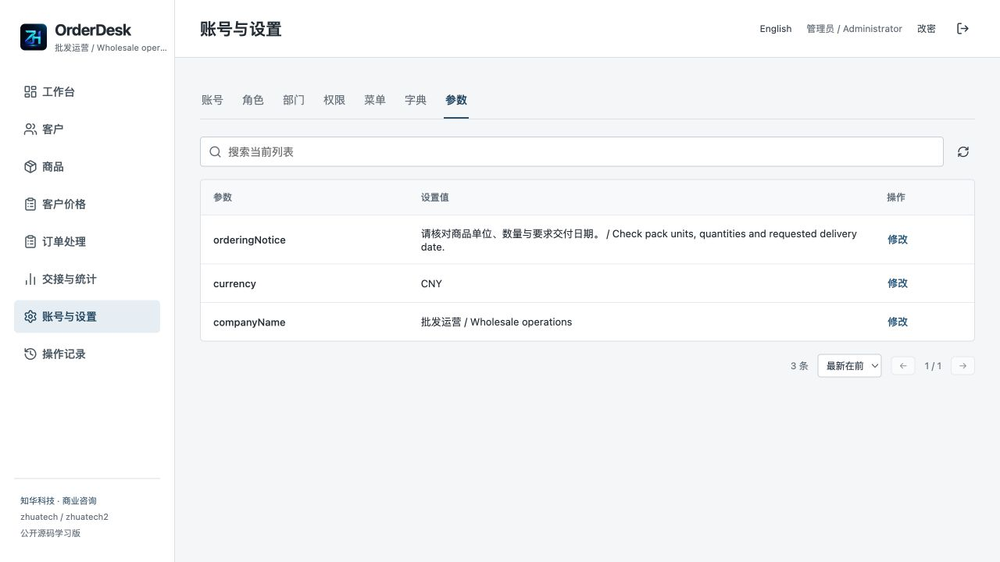
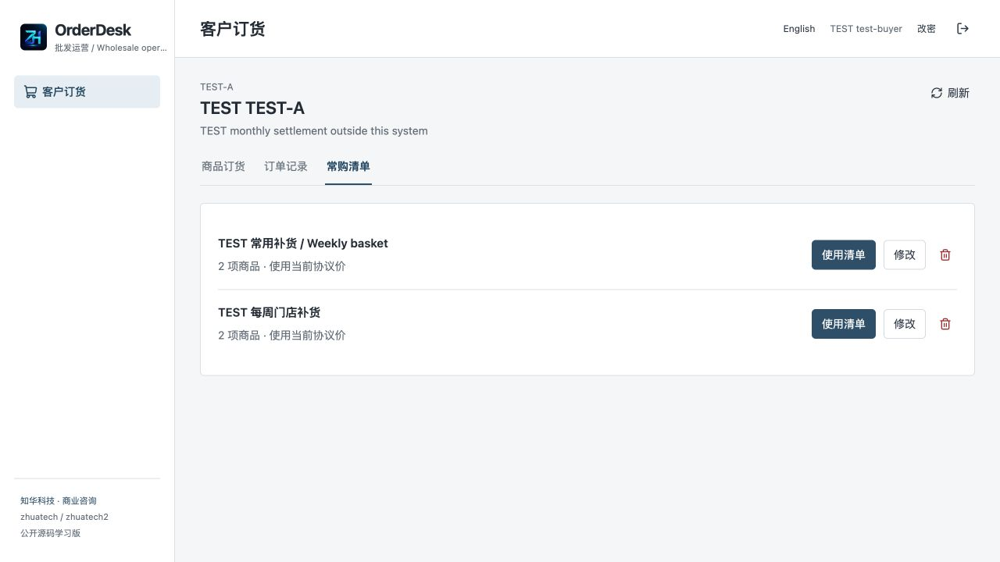
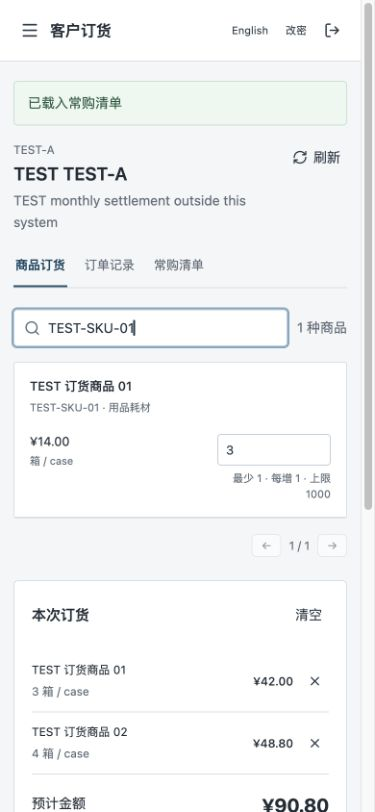

[中文](README.md) | [English](README.en.md)

# ZhiHua OrderDesk · Wholesale Customer Ordering Portal

**ZhiHua Technology (Shanghai Rujing Zhihua Information Technology Co., Ltd.)** · [Official website](https://www.zhuatech.cn/).

Version 1.0.0 uses Java 21, Spring Boot, Vue 3 and MySQL for customer-specific catalogues, negotiated prices, recurring baskets, order review and partial warehouse handoffs. **Public source for learning / non-commercial use:** own-source individual learning, technical research and non-commercial exchange under the existing [LICENSE](LICENSE). Commercial delivery, paid hosting, business private deployment, SaaS and source resale require prior written company authorization. It is not an OSI open-source license; dependencies retain their original terms.

## Scenarios and collaboration

For suppliers with established wholesale customers, restricted product ranges and negotiated prices, plus IT teams implementing private deployments/integration. Customer ordering and supplier handoff share a reviewed order; this release does not replace internal inventory or finance software.

1. Administrator creates departments, categories, products, customers and delivery addresses.
2. Assign customer-specific products, prices, minimum quantities, increments and maxima. CSV supports preview and atomic batch maintenance.
3. Create customer accounts bound to one customer in the same department. Customers cannot read employee directories or other customers' catalogues, baskets or orders.
4. Customers enter integer packaging quantities on desktop/mobile, save and review draft amount/delivery date, then submit. Recurring baskets and historical orders can be loaded using current catalogue prices.
5. Supplier confirms or rejects with a reason. Submission and confirmation recheck prices, product identity and packaging; changes require a renewed review rather than silent amount replacement.
6. Confirmation freezes negotiated prices and delivery details. Staff record unique external references and partial quantities; complete handoff becomes `FULFILLED` only when every quantity is delivered in the record.
7. Export confirmed/fulfilled order lines by UTC submission date for your own warehouse system. This is manual handoff data, not live logistics or WMS synchronization.

Customer workspace contains that customer's ordering, orders and baskets. Supplier workspace maintains master data, review and handoffs; administrator workspace manages accounts/configuration. Interfaces use real authorization and server persistence rather than local demo arrays. Chinese/English UI is implemented.

## Implemented features and boundaries

| Area | Implemented behavior |
| --- | --- |
| Customers | Department scope, address/settlement text, enabled state, CRUD/version checks and protected references |
| Products | SKU, Chinese/English names, packaging unit, category, enabled state and version; shared writes require ALL scope |
| Price lists | Customer/product price and quantity rules, CSV export/preview and up to 500 atomic imported rows |
| Customer portal | Private catalogue, draft amount review, submit/withdraw, rejection revision, repeat ordering and basket CRUD |
| Supplier operations | Department-based review/rejection/confirmation, cancellation before handoff, frozen order, partial/full handoff |
| Guards | Write versions, precise decimal amounts, duplicate products, cross-customer rejection, overdelivery and duplicate-reference rejection |
| Reports/export | Actual status counts, confirmed/fulfilled amounts, recent orders, UTC submission-date CSV and remaining quantities |
| Administration | Users, roles, permission display names, menus, departments, category dictionaries, parameters and last-admin protection |
| Common UI/security | Search/filter/sort, ten-row pages, events/audit, sessions, BCrypt, CSRF, password change and health |

Not implemented: inventory reservation/deduction, automatic ERP/WMS synchronization, email/SMS, payment/refund, invoices/tax calculation, credit limit/reconciliation, shipment tracking, public registration, cross-company multitenant SaaS, photo attachments or simultaneous multicurrency trading. Negotiated amounts do not prove collection or invoicing. Settlement notes are text, not a billing engine.

No third-party key is needed to run. HTTPS certificates and external databases are deployment configuration. Payment/email/ERP adapters require development and cannot be enabled by filling one key. Account credentials must be privately handed over by the administrator; the system does not email plaintext passwords.

## Actual running screenshots

These existing screens were captured from an independent test database. TEST customers/products/orders are fictional acceptance fixtures and are not created by an empty installation.

| Account login | Customer catalogue and order entry |
| --- | --- |
|  |  |
| Supplier workspace | Order detail and recorded fulfilment |
|  |  |
| Account management | Order statistics and warehouse CSV |
|  |  |
| Roles and permissions | Instance parameters |
|  |  |
| Recurring baskets | Narrow-screen ordering |
|  |  |

## Environment and startup

Java **21**, Maven **3.9**, Node.js **24.19.0+**, MySQL **8.4**, Docker and Compose v2. Spring Boot **4.0.7**, Vue **3.5.40**, Vite **8.1.5** and MariaDB Java Client **3.5.10** are pinned. The JDBC connector uses `jdbc:mariadb://` to connect to MySQL; the database server is MySQL.

From the repository root:

```sh
python3 scripts/init-env.py
# Read the first administrator password privately from .env; never publish it.
docker compose config --quiet
docker compose up -d --build --wait
```

Open [http://localhost:8116/](http://localhost:8116/), health at [http://localhost:8116/actuator/health](http://localhost:8116/actuator/health). Staff and customers share the login page, entering the workspace for their actual permissions. Initial username defaults to `admin`; password comes from private `.env` `ADMIN_PASSWORD`, without a public universal credential. The initialization script generates distinct strong values with file mode 0600 and refuses to overwrite `.env`.

First installation creates an administrator, four roles, eight permissions, nine menus, a base department, three product categories and three parameters. It creates **no customers, products, negotiated prices, business orders or other accounts**. Categories drive actual product forms. Restart does not reset passwords.

| Configuration | Purpose |
| --- | --- |
| `MYSQL_ROOT_PASSWORD` | Independent strong database-administration password |
| `DATABASE_PASSWORD` | Independent application database password |
| `ADMIN_USERNAME` / `ADMIN_PASSWORD` | First account and 12–72-byte password with uppercase/lowercase/digits |
| `WEB_PORT` / `BIND_ADDRESS` | Default 8116 / 127.0.0.1; choose an unused test port |
| `COOKIE_SECURE` | False for local HTTP learning, true for trusted HTTPS |
| `DATABASE_URL` / `DATABASE_USER` | Optional external MySQL; verify TLS/CA outside the isolated network |

`.env.example` contains configuration names without real secrets. MySQL/backend do not expose host ports; do not stop unrelated services for a conflict.

For separate development:

```sh
docker compose up -d mysql --wait
# Privately inject a reachable MySQL address/account/password as DATABASE_URL/USER/PASSWORD,
# and initial ADMIN_USERNAME/ADMIN_PASSWORD. Compose does not expose its DB to the host.
mvn -f backend/pom.xml spring-boot:run
cd frontend
npm ci --no-audit --no-fund
npm run dev
```

Vite at localhost 5173 proxies backend 8080; deployed Nginx uses same-origin `/api` and SPA fallback. Use your own reachable isolated database for host backend development, rather than assuming Compose's private DB hostname works from the host.

## Architecture, directories and database

```text
backend/src/main/java/cn/zhuatech/orderdesk/    Authorization, administration and ordering transactions
backend/src/main/resources/db/migration/      Versioned Flyway SQL
backend/src/test/                              Rule and HTTP/JPA tests
frontend/src/                                 Customer/supplier/admin and bilingual UI
frontend/public/brand/                         Official logo and local brand assets
scripts/                                      Initialization, release scan and isolated acceptance
docs/                                         Manual, API, deployment, database, security and screenshots
compose.yaml                                  MySQL / Spring Boot / Vue Nginx
```

Spring Security handles sessions/CSRF and real-time account/role checks; business services enforce customer binding, department, version, quantity and price. JPA/Flyway/MySQL persist all data. Nineteen application tables plus Flyway history are created by `V1__order_schema.sql`. Foreign keys protect history; customer/product price, order reference, basket name per customer and handoff reference have uniqueness constraints. Confirmed order names/units/prices and customer address are snapshots; baskets store product references/quantities rather than old prices.

Order states: `DRAFT → SUBMITTED → CONFIRMED → FULFILLED`. Submitted orders can be rejected, revised to draft and reviewed again. Customers can cancel draft/submitted orders with a reason; staff cancellation requires no prior handoff. Actions validate and advance revision. Entered historical workflow is retained instead of deleted.

Server `BigDecimal` prices allow two decimals without silent rounding. Quantities, IDs and versions reject fractional truncation. Packaging quantities follow `minQty + n × stepQty`, not arbitrary loose units. The instance currency locks once price lists/orders exist. Draft client estimates have no posting authority. Delivery dates are requested dates within UTC today plus 365 days; handoff CSV uses UTC submission day.

Transactions lock the base department to serialize version/quantity checks. Atomic import failure rolls back all rows and audit. Authorized lists are capped at 10,000, then filtered/sorted/paged in the browser. This is a single-instance small/medium supplier system, without distributed-scale/multitenant claims. Business data is in MySQL, while sessions are in memory and need new login after restart.

## Deployment, migration and backup

The same-origin gateway defaults to localhost. For external access configure trusted HTTPS, `COOKIE_SECURE=true`, appropriate proxy/firewall boundaries and least-privilege credentials. Compose's internal JDBC `sslMode=trust` is unsuitable for an external database; use `sslMode=verify-full` with a trusted CA and matching hostname. Backend/frontend containers run as non-root. There is no publicly hosted trial claimed here.

Flyway applies versioned migrations at startup; JPA only validates structure. Current migration is V1. Add new V2+ SQL for upgrades, never edit applied V1 or erase history. First back up, restore into an independent volume and validate before upgrading.

The Chinese [deployment guide](docs/deployment.md) includes the complete scoped dump/import commands. SQL contains addresses, negotiated prices and account hashes: keep it private, mode 0600, outside Git. Use a distinct Compose project/web port and fresh empty volume; start MySQL, import the full dump, then start the application. The restored account passwords remain the original ones, not a new environment's initial password. Check Flyway, accounts, price snapshots, baskets and partial quantities before deciding a switch.

`down` retains data; `down -v` removes that project's volumes and is only for explicitly disposable test projects. Never import into an existing production volume as an unreviewed test or clean up another project's resources. Encryption, retention and repeated recovery rehearsal are operator responsibilities.

## Checks and troubleshooting

```sh
mvn -B -f backend/pom.xml spotless:check test package
cd frontend
npm ci --no-audit --no-fund
npm run format:check
npm run lint
npm test
npm run build
cd ..
python3 scripts/release-check.py
git diff --check
docker compose config --quiet
docker compose build
```

There are 20 backend tests (three rule/seventeen HTTP/JPA) and ten frontend tests. Docker builds perform full tests. H2 covers fast transaction/migration regression and cannot replace actual MySQL validation. `scripts/smoke-test.py` is exclusively for a **new, isolated, disposable database**, writes TEST fixtures and private ignored output credentials, and must not target production or an existing business installation. See [testing](docs/testing.md) for actual interface, restart and independent recovery methods.

For unreachable pages check the web port, scoped logs and three healthy services. For an empty customer catalogue check customer/category/product/price enabled state and binding. Minimum 5/increment 3 means 5, 8, 11. Price/unit changes require the customer to resave/review; supplier returns a submitted order for revision. Version errors require reload and review, not unchanged form replay. CSV headers must match export, new revision is blank, updates retain current revision; unknown/duplicate rows roll back all. Shared product writes require ALL scope; customer accounts require CUSTOMER scope, only portal permission and matching department/customer binding.

## Security, limits and feedback

BCrypt cost 12, HttpOnly/SameSite Strict 30-minute session cookies, CSRF, safe error codes, live authorization, reset revocation and last-admin protection are implemented. Login limiting is an in-memory single-instance five-minute/eight-failure window. CSV neutralizes formula prefixes; imports are bounded UTF-8 CSV parsed to validated JSON, with no formula execution or generic file-storage API. Browser CSV limits are 500 rows/512 KiB; gateway body limit is 4 MiB. No inventory/payment/tax/shipment integration or regulatory certification is implied.

The source is provided as-is under the existing [LICENSE](LICENSE). Trade, tax, collections, transport and data retention remain the operator's responsibility; the project does not promise transaction completion or compliance certification. Third-party terms remain independent; see [declarations](docs/third-party.md).

Issues should contain version, environment, anonymized reproduction and expected/actual results. Preserve copyright/licensing and validate small contributions. Report vulnerabilities privately without customer addresses, negotiated prices, passwords, cookies or database dumps. Chinese [manual](docs/manual.md), [API](docs/api.md), [database](docs/database.md), [architecture](docs/architecture.md) and [security](docs/security.md) explain operations and boundaries.

## Contact ZhiHua Technology

**ZhiHua Technology (Shanghai Rujing Zhihua Information Technology Co., Ltd.)**. Commercial authorization, private deployment, customization and system integration:

- Website: [https://www.zhuatech.cn/](https://www.zhuatech.cn/)
- Email: [han@zhuatech.cn](mailto:han@zhuatech.cn)
- Email: [jack@zhuatech.cn](mailto:jack@zhuatech.cn)
- WhatsApp: [+86 17521234993](https://wa.me/8617521234993)
